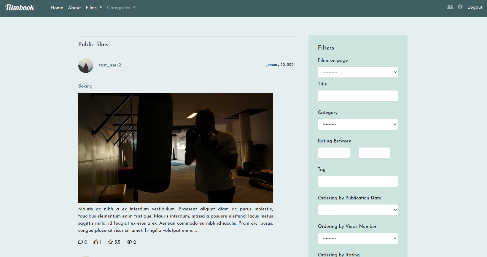
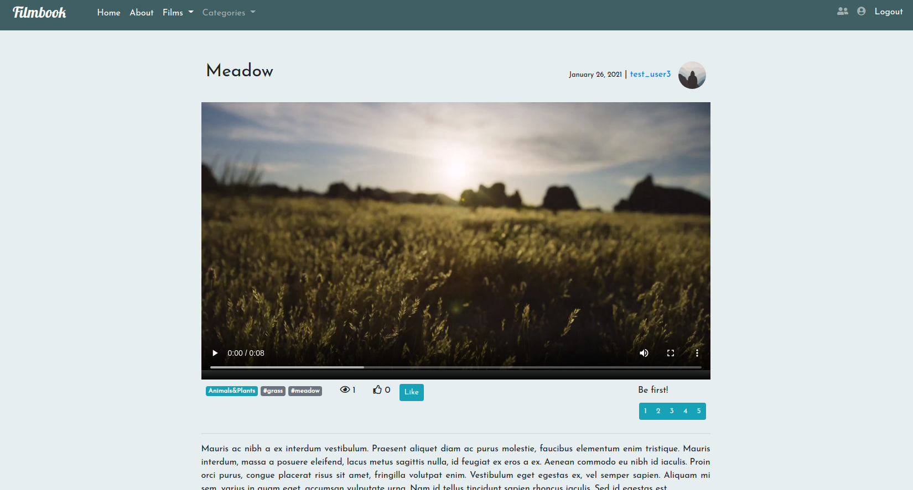
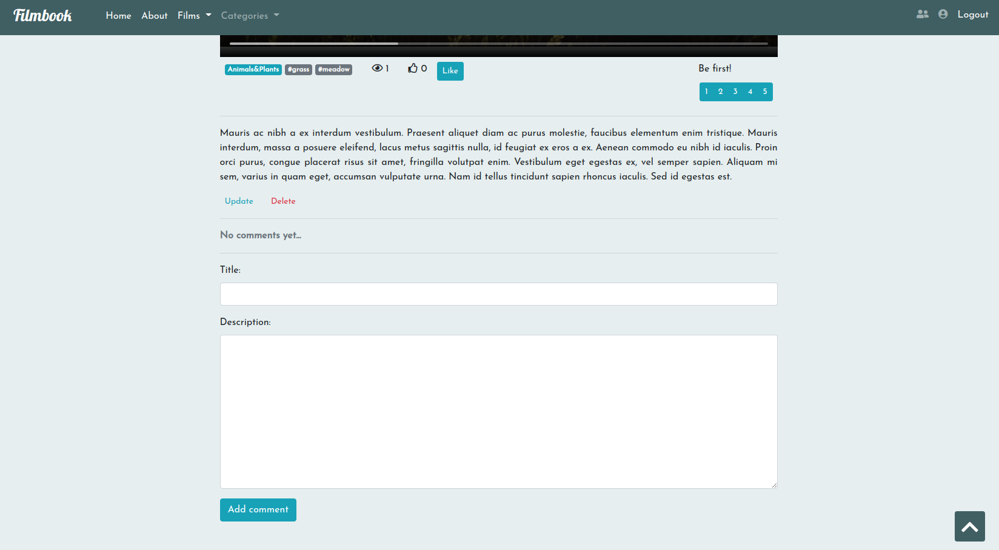
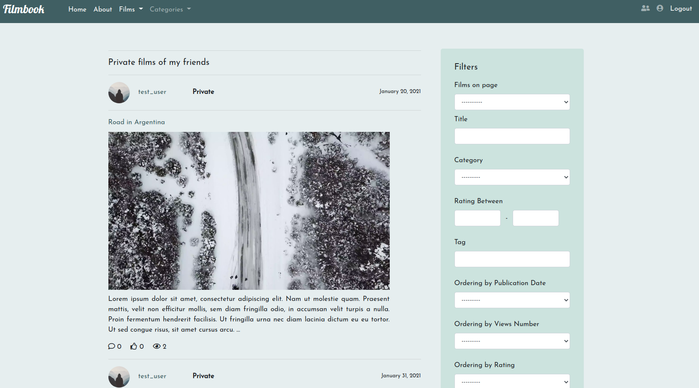
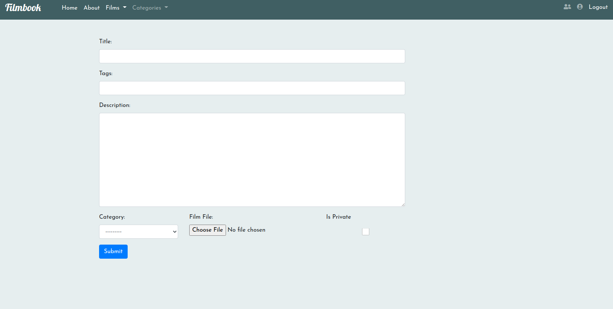
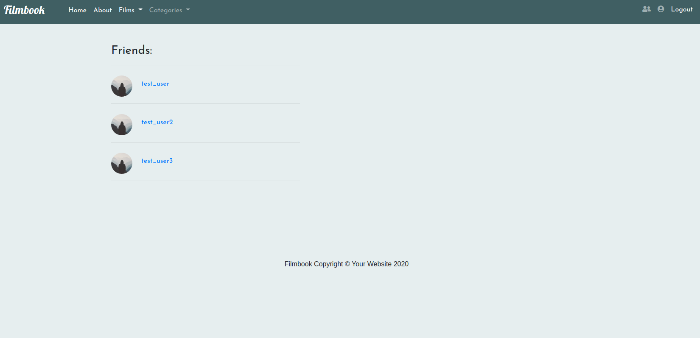
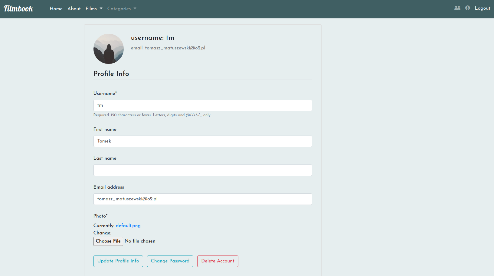

### Filmbook -> SDA Final Project 

Technologies used: Django, Bootstrap, HTML, CSS, JavaScript, SQLite, Docker

    Django Library used:
    - Django Filter
    - Django Crispy Forms
    - Django Taggit
    - Django HitCount
    - Pytest
    - Pytest Django
    - MoviePy, Pillow

    run with Docker (go to Filmbook directory in Terminal):
    - docker-compose up

    - to create superuser and load fixture (if needed)-> other termianl
        - docker exec -it filmbook_webapp_1 bash
        - python manage.py loaddata films.json
        - python manage.py createsuperuser
   
    - http://127.0.0.1:8000
    - register and login !

    or manually 

    - git clone <repo> .
    - virtualenv venv
    - source venv/bin/activate
    - pip install -r requirements.txt
    - python manage.py migrate
    - python manage.py loaddata films.json -> if needed
    - create superuser -> if needed
    - python manage.py runserver
    - http://127.0.0.1:8000
    - register and login

Screenshots:

